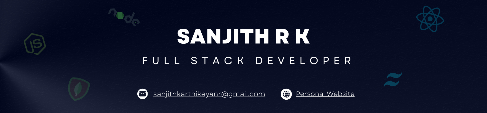

<hr/>

<div align="center">
    
</div>

<h3 align="center">Full Stack Developer | Exploring the Boundless World of Technology</h3>
<p align="center"></p>

<div align="center">
I'm a passionate and dedicated aspiring full stack developer with a strong interest in creating dynamic and responsive web applications. My journey in the world of coding began with curiosity and has since evolved into a full-fledged passion for developing robust and scalable solutions.
</div>

<h3 align="center">🌐 Connect with me</h3>
<div align="center">
  <a href="https://sanjith-portfolio.netlify.app/" target="_blank"></a>
  <a href="mailto:sanjithkarthikeyanr@gmail.com" ></a>
  <a href="https://www.linkedin.com/in/sanjithrk06/" target="_blank"></a>
</div>

---
<h3 align="center"> Programming Languages </h3>
<div align="center">
  
</div>

<h3 align="center"> Development Frameworks</h3>
<div align="center">
  
  
</div>

<h3 align="center"> DevOps & Tools :</h3>
<div align="center">
  
</div>

---

<h3 align="center">My Statistics 📊</h3>
<p align="center">
<table align="center">
<tr>
<td colspan="2" align="center">


<!--START_SECTION:waka-->

```txt
JavaScript   12 hrs 37 mins  █████████████████████▒░░░   85.91 %
Bash         1 hr 1 min      █▓░░░░░░░░░░░░░░░░░░░░░░░   06.94 %
Python       19 mins         ▓░░░░░░░░░░░░░░░░░░░░░░░░   02.25 %
Git Config   12 mins         ▒░░░░░░░░░░░░░░░░░░░░░░░░   01.43 %
JSON         11 mins         ▒░░░░░░░░░░░░░░░░░░░░░░░░   01.34 %
```

<!--END_SECTION:waka-->


</td>
</tr>
<tr>
<td colspan="2" align="center">

  

</td>
</tr>
<tr>
<td width="50%" align="center">

  

</td>
<td width="50%" align="center">

  

</td>
</tr>
</table>
</p>

---

<div align="center">Thank you for visiting my profile!👍</div>
