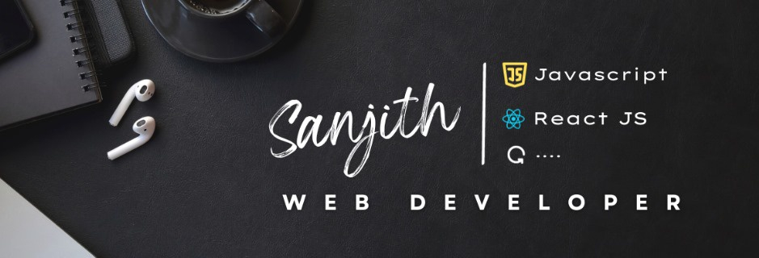

# Hi there! I'm Sanjith R K 

I'm a passionate and curious individual deeply interested in technology and its applications. Currently, I'm pursuing a degree in Computer Science at **Bannari Amman Institute of Technology**, where I'm constantly exploring new concepts and pushing the boundaries of my knowledge.

---
## What I'm passionate about:

- 💡 Exploring new technologies and discovering innovative solutions.
- 🌱 Learning and growing, especially in the realms of Web development.
- ✍️ Pursuing Web Design as creative outlets and side projects.

---
## What I'm currently up to:

- 🎓 Studying hard to deepen my understanding of computer science fundamentals and mathematical principles.
- 🛠️ Working on personal coding projects to apply what I've learned and to experiment with new technologies.
- 📚 Researching and staying updated on the latest advancements in the tech industry.

---
  

  

### 🛠 &nbsp;Tech Stack

  

&nbsp;&nbsp;&nbsp;&nbsp;&nbsp;&nbsp;&nbsp;&nbsp;&nbsp;&nbsp;&nbsp;&nbsp;&nbsp;

&nbsp;&nbsp;&nbsp;
---
## 🤝🏻 &nbsp; Let's connect and collaborate:

- 💬 Interested in engaging discussions, brainstorming sessions, or collaborative projects.
- 📫 You can reach out to me via email at [sanjithkarthikeyanr@gmail.com]. I'm always open to new opportunities and conversations!
- 📄 Check out my [Portfolio](https://www.sanjith-portfolio.netlify.app) for a more detailed overview of my skills and experiences.

      

---

